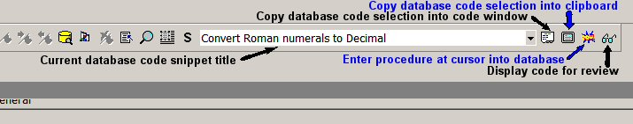



## Code Library Add In

### Description

*Updated* Add In for VB6 IDE that puts a dropdown combo in the Standard Toolbar that references and links to a code snippet library. Allows for pasting into current code window and saving new snippets to the database. Access all of your code snippets right from the IDE with no cut and paste operations neccessary.

*Added feature to delete snippets from database

*Combined View and Paste operations

*Removed use of clipboard

*Added optional code to add a separate toolbar if desired

** Thanks to Roger Gilchrist for the good suggestions
 
### More Info
 
Location constant for the code database will need to be edited to reflect actual location before compiling to a DLL

             |
---                |---
**Submitted On**   |2005-09-26 21:36:06
**By**             |[Chuck Smithwick](https://github.com/Planet-Source-Code/PSCIndex/blob/master/ByAuthor/chuck-smithwick.md)
**Level**          |Advanced
**User Rating**    |4.4 (40 globes from 9 users)
**Compatibility**  |VB 6\.0
**Category**       |[Coding Standards](https://github.com/Planet-Source-Code/PSCIndex/blob/master/ByCategory/coding-standards__1-43.md)
**World**          |[Visual Basic](https://github.com/Planet-Source-Code/PSCIndex/blob/master/ByWorld/visual-basic.md)
**Archive File**   |[Code\_Libra1935849272005\.zip](https://github.com/Planet-Source-Code/chuck-smithwick-code-library-add-in__1-62679/archive/master.zip)

